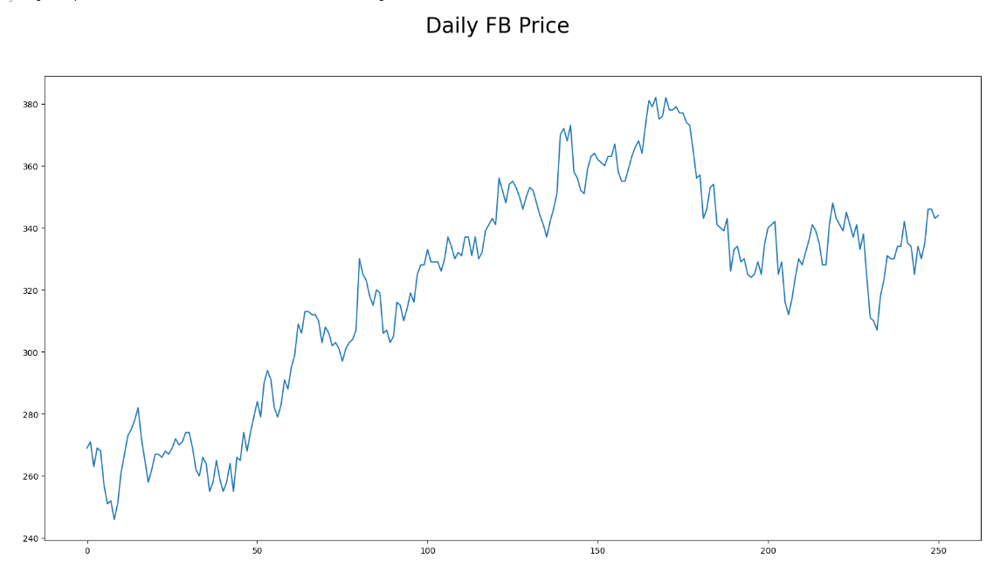
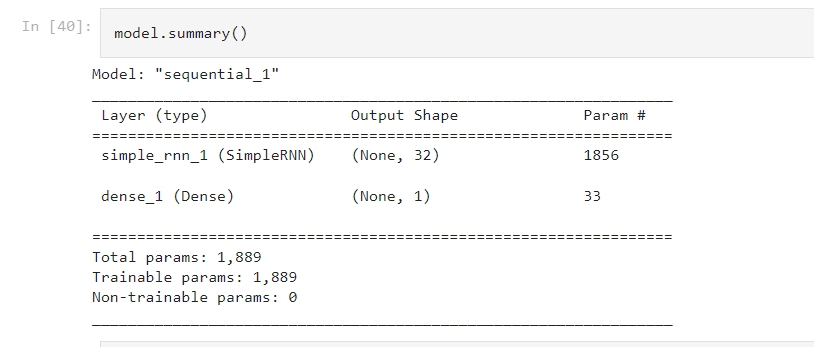
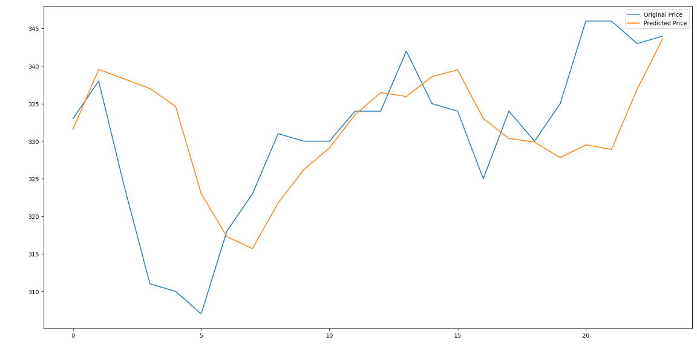

# Predicting-Stock-Prices-Using-RNN

In this project, the aim was to predict the stock price of Facebook (FB) based on daily data. The chosen approach for prediction was a simple RNN (Recurrent Neural Network) model. 

The RNN model is a type of neural network that can analyze sequential data, making it suitable for analyzing time-series data like stock prices. By using historical data, the model can learn patterns and trends, allowing it to make predictions about future stock prices.
 
<h3>Stock Prices</h3>

 
<h3>Model Summary</h3>

 
 
<h3>Prediction VS ORIGINAL</h3>

